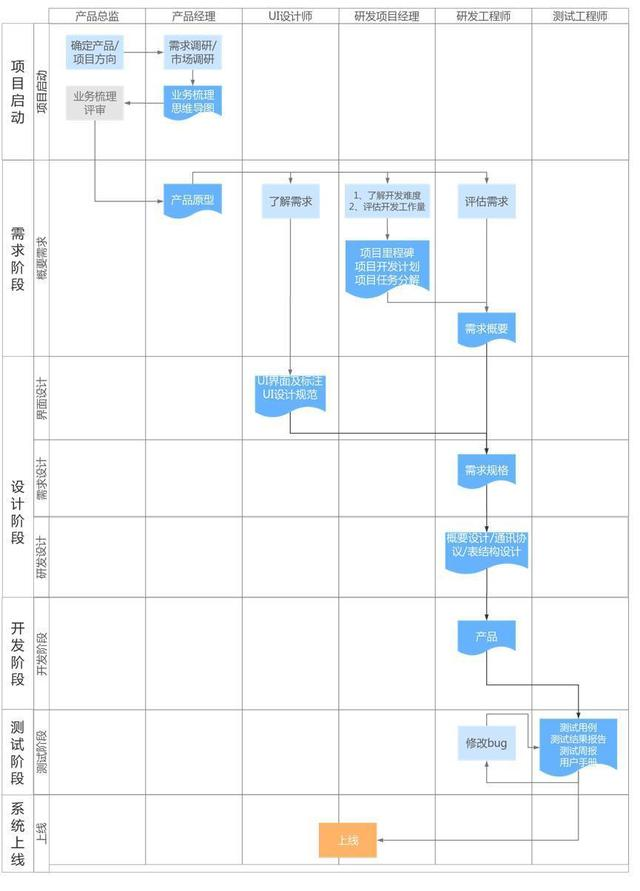

#总体说明
为了更好的把握软件开发的整体流程，需要针对软件开发中各个环节进行深入实践。一般的软件开发会有以下几个生命周期：

由于 gblog 定位于个人站点，所以侧重于以下几个节点：
- 需求阶段
    - 输出PRD（可简要）
    - 输出开发计划（着重于里程碑）
- 设计阶段
    - 输出 UI 设计文稿（暂时仿照 https://www.iphpt.com/?page=1）
    - 系统设计
        - 输出概要设计文档（架构文档、数据库设计文档、接口设计文档）
- 开发阶段
    - 针对重要的模块出详细设计文档(这里把详细设计放到了开发阶段，是因为大部分项目在前期的需求变更都很频繁，所以把详细设计往后退了一个节点)
- 测试阶段
- 上线阶段